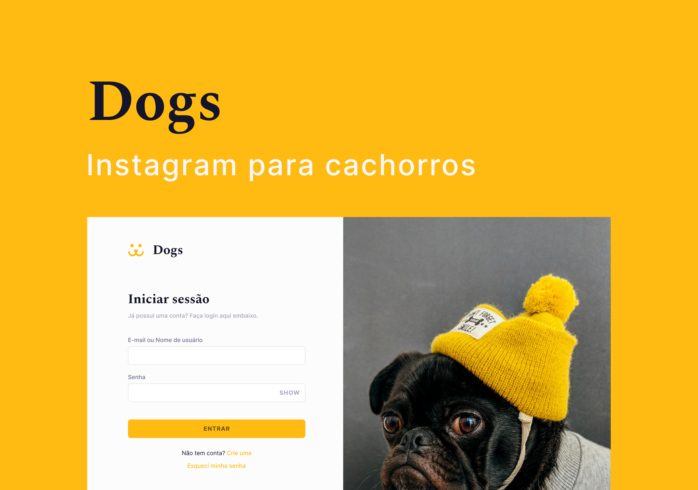

<h1 align="center">
  
</h1>

<p align="center">
  
   
   
   
   
</p>

<div align="center">
  <a href="#-sobre">Sobre</a>&nbsp;&nbsp;&nbsp;|&nbsp;&nbsp;&nbsp;
  <a href="#-tecnologias">Tecnologias</a>&nbsp;&nbsp;&nbsp;|&nbsp;&nbsp;&nbsp;
  <a href="#-como-executar">Como Executar</a>&nbsp;&nbsp;&nbsp;|&nbsp;&nbsp;&nbsp;
  <a href="#-todo">Todo</a>&nbsp;&nbsp;&nbsp;|&nbsp;&nbsp;&nbsp;
  <a href="https://www.figma.com/file/qZVVZzTWNF4SrAUqDqdiG2/Dogs?node-id=201%3A2">Figma</a>
</div>



## 🔖 Sobre

Dogs é um instagram para cachorros onde o usuário pode publicar uma foto, comentar, curtir e seguir outros usuários. Nessa aplicação utilizo, na parte web, [React](https://reactjs.org) com [TypeScript](https://www.typescriptlang.com), [Styled Components](https://styled-components.com) para os estilos e o [React Query](https://react-query.tanstack.com) para fazer a busca, cache e atualização dos dados do servidor que foi feito em [Node](https://nodejs.org/en/) com [Express](https://expressjs.com/pt-br/) e [TypeORM](https://typeorm.io/#/).

## 📦 Tecnologias

- Frontend
  - [ReactJS](https://reactjs.org)
  - [TypeScript](https://www.typescriptlang.org)
  - [React Router](https://reactrouter.com)
  - [Styled Components](https://styled-components.com)
  - [React Query](https://react-query.tanstack.com)
- Backend
  - [NodeJS](https://nodejs.org/en/)
  - [TypeScript](https://www.typescriptlang.org)
  - [PostgreSQL](https://www.postgresql.org)
  - [Express](https://expressjs.com/pt-br/)
  - [TypeORM](https://typeorm.io/#/)
  - [JWT](https://jwt.io)

## 🚀 Como Executar

##### Clone o repositório

```
git clone https://github.com/joaom00/dogs.git
```

### Executando o Servidor

##### Crie um arquivo `.env` dentro da pasta `server` e preencha com as seguintes informações:

```
DATABASE_HOST=
DATABASE_PORT=
DATABASE_USERNAME=
DATABASE_PASSWORD=
DATABASE_NAME=
```

##### Dentro da pasta `server` execute:

```
make
```

O script irá:

- Instalar as dependências
- Criar o banco de dados
- Executar as migrations
- Executar o servidor na porta `3333`

##### Para executar o servidor em modo de desenvolvimento

```
make dev
```

### Executando o Cliente

##### Dentro da pasta `client` execute:

```
make
```

O script irá:

- Instalar as dependências
- Executar o client na porta `3000`

##### Para executar o cliente em modo de desenvolvimento

```
make dev
```

## Todo

| Status  | Funcionalidade             |
| :-----: | -------------------------- |
| &#9744; | Pesquisar usuários         |
| &#9744; | Redefinir senha pelo email |
| &#9745; | Editar foto de perfil      |
| &#9745; | Excluir comentário         |
| &#9745; | Página de seguidores       |
| &#9745; | Página de seguindo         |
| &#9745; | Excluir publicação         |
| &#9745; | Seguir usuários            |
| &#9745; | Pubicar fotos              |
| &#9745; | Comentar nas fotos         |
| &#9745; | Curtir as fotos            |
| &#9745; | Criar conta                |
| &#9745; | Logar em uma conta         |

## 📝 License

[MIT License](./LICENSE)
